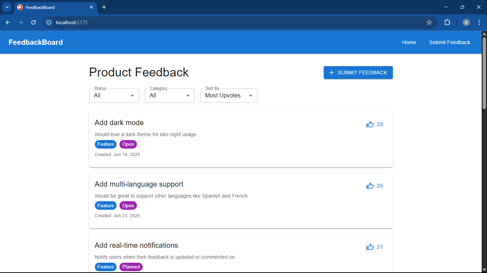

# Feedback Product Board - FRONTEND

A minimal, fully-functional Feedback Product Board web app built using React, Redux Toolkit, Material UI, and json-server as a mock backend through db.json.

## Live Demo
Frontend Web Application: https://bahavathy-feedback-board.netlify.app/
Backend (JSON Server API): https://feedbacks-757d.onrender.com/

## Project Overview

This project is a simplified product feedback system where users can:

- View a list of feedback items
- Filter feedback based on categories such as Feature or Bug
- View detailed information about each feedback item
- Submit new feedback using a form

The app uses Redux Toolkit for state management and connects to a local mock API created using json-server and db.json to simulate backend operations.

## Setup Instructions

Step 1: Create project folder using vite

```bash
npm create vite@latest
```

Step 2: Install all dependencies

```bash
npm install
```

Step 3: Install required libraries

```bash
npm install react-router-dom @reduxjs/toolkit react-redux @mui/material @emotion/react @emotion/styled json-server
```

Step 4: Run the React application using Vite

```bash
npm run dev
```

This starts the frontend on:
http://localhost:5173

Step 5: Run the mock API server

```bash
npx json-server --watch db.json --port 4000
```

This starts the backend API on:
http://localhost:4000

## Tech Stack Used

React – for building the user interface  
Redux Toolkit – for managing application state  
React Router – for client-side routing  
Material UI – for UI components and styling  
json-server – for simulating a RESTful API  
Vite – for faster development and hot reloading

## Screenshots




## API Docs (db.json)

The application uses a file named db.json as a local JSON database. Below is a sample structure of the feedback data:

```json
{
  "feedback": [
    {
      "id": "1",
      "title": "Add dark mode",
      "description": "Would love a dark theme for late-night use.",
      "category": "Feature",
      "status": "Open",
      "upvotes": 12,
      "createdAt": "2025-06-19T10:00:00Z"
    }
  ]
}
```

## Available endpoints:

GET /feedback – fetch all feedback items  
GET /feedback/:id – fetch feedback by ID  
POST /feedback – add a new feedback item  
PUT /feedback/:id – update a feedback item  
DELETE /feedback/:id – delete a feedback item

## Hosting
The frontend is built with React (Vite) and deployed on Netlify.
The backend uses JSON Server to mock REST API functionality and is hosted on Render.com.
All feedback data is fetched from the JSON server using HTTP requests.
